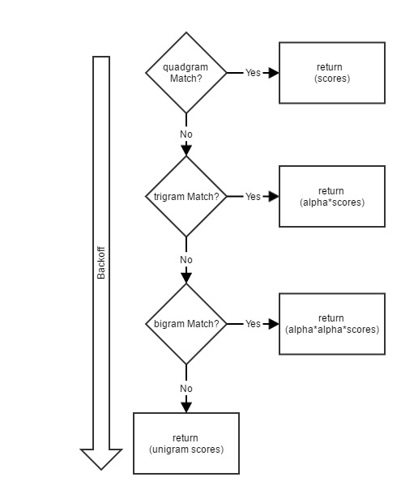
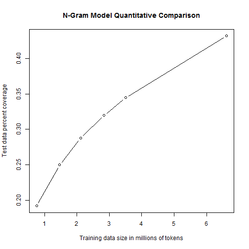
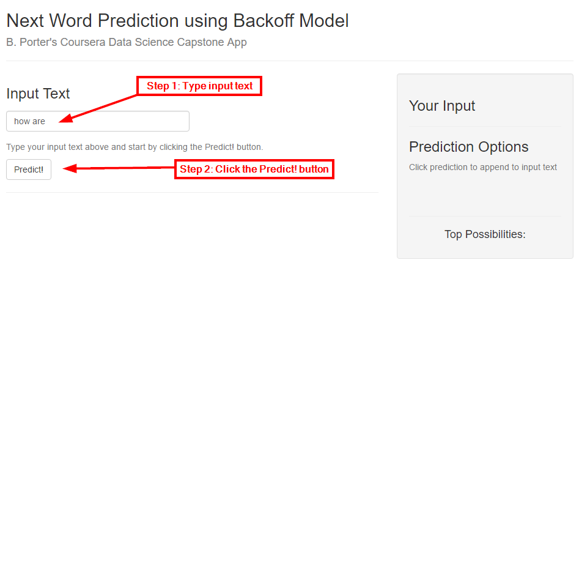
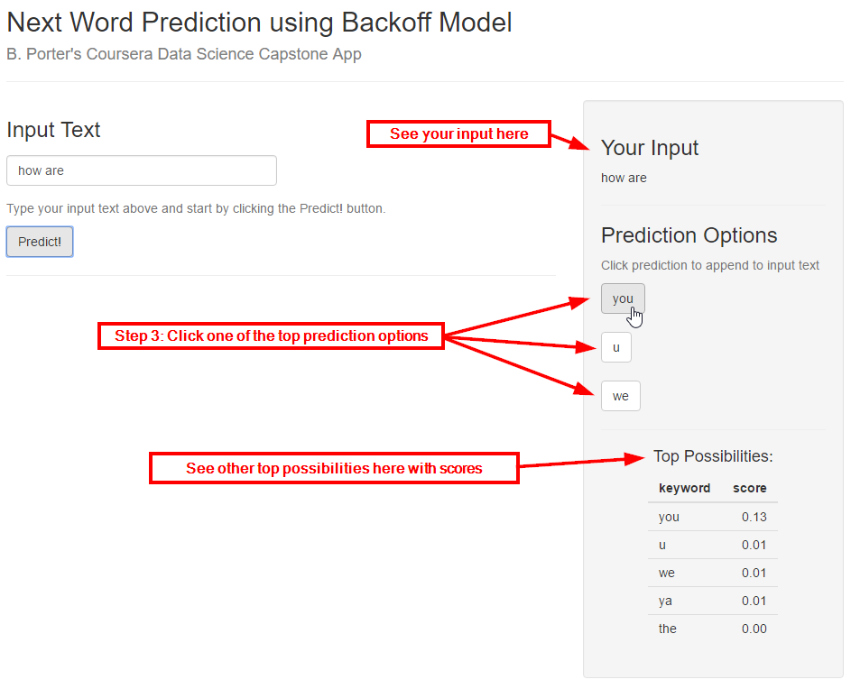
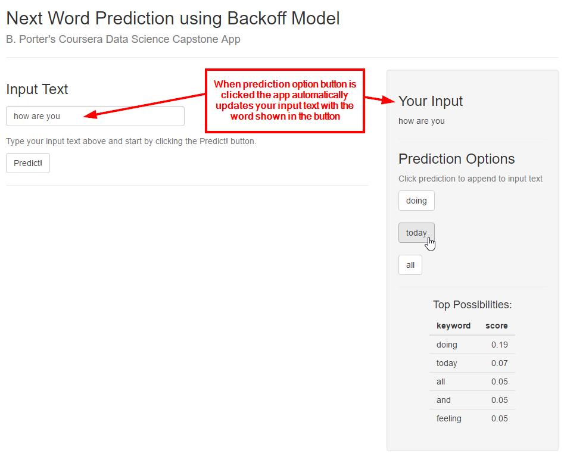

Word Prediction based on Stupid Backoff N-gram Model
========================================================
author: B. Porter
date: 2016-01-02
autosize: true

Presentation of the ShinyIO app called "Wordy" for Coursera Data Science Specialization Capstone Project

Introduction
========================================================

- Goal: Develop algorithm to predict the next term in a sentence and create a shiny app to show off algorithm
- Algorithm: N-gram models with Stupid Backoff to smooth and predict on unseen terms
- ShinyIO App: A simple UI to interact with the text prediction model and create new text

***

Stupid Backoff Diagram

Prediction Model
========================================================
- N-gram model that uses Stupid Backoff for smoothing as described in [Large Language Models in Machine Translation](http://www.aclweb.org/anthology/D07-1090.pdf)
- Scores are calculated using the following scheme. We used $\alpha = 0.4$

$$
S(w|w_{i-k+1}^{i-1}) = \left\{\begin{matrix}
\frac{f(w_{i-k+1}^i)}{w_{i-k+1}^{i-1}}, \mathbf{if} f(w_{i-k+1}^i) > 0 & \\ 
\alpha S(w_i|w_{i-k+2}^{i-1}) & otherwise
\end{matrix}\right.
$$

Quantitative Results
========================================================
- Model uses relative frequency score, not normalized probabilities so perplexity cannot be used.
- Graph shows how many 4-grams in the test dataset were seen by 4-grams in training dataset as dataset size increases

Wordy - The Shiny App
========================================================
- When the app starts there is a text input field that is pre-filled with text that you can easily replace
- Step 1: Input your text into the text field
- Step 2: Click the Predict! button to see the top possibilities from the prediction model
- Step 3: Click one of the top prediction options to see it automatically appended to the input text

***

Wordy - The Shiny App Continued
========================================================

***

